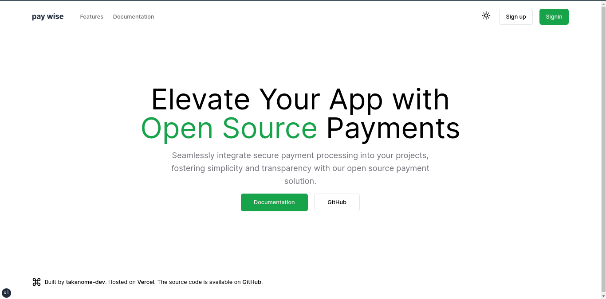

<h1 align="center"> Pay Wise </h1>

   Seamlessly integrate payment processing into your projects

  
  
  

## :construction: Status :construction

**Pay Wise** is currently _early_ in the development cycle. This app is
not yet functional but is being actively developed. Please "watch" the project and leave a star and help us build this platform.

> **Note**
>
> The logo is not final and will probably change in the future. If you have any ideas, please open an issue. Same goes for the name and branding 😃

## :bulb: Features

- [x] Log in with oauth
- [x] Create credit cards
- [ ] Accept payments
- [ ] Create customers
- [ ] What else?

## :desktop_computer: Local development

Check out the [local development](./docs/contributing/development.mdx) to learn how you can start working on this project.

## :handshake: Contributing

We welcome contributions of all sizes, from small bug fixes to new features. Just check out the open issues and pull requests to see where you can make an impact.
Don't forget to read our [Contributing Guide](./docs/contributing/development.mdx) to learn how you can get involved.

## :balance_scale: LICENSE

The scripts and documentation in this project are released under the [MIT LICENSE](LICENSE)

## :pray: Support

Don't forget to leave a ⭐ if you like this project :wink:
